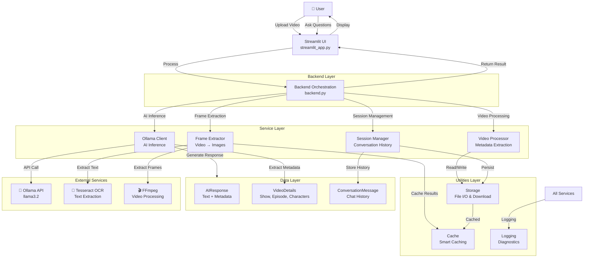

# Video Brain Architecture

## System Overview

## Component Details

### Streamlit UI (`streamlit_app.py`)

- User interface for uploads and Q&A
- Session state management
- Real-time video preview and analysis display

### Backend Orchestration (`backend.py`)

- Coordinates service layer interactions
- Handles video uploads and processing
- Manages conversation flow

### Services

- **OllamaClient**: AI inference via local Llama model
- **FrameExtractor**: Video → key frames → text/features
- **VideoProcessor**: Metadata extraction (duration, FPS, dimensions)
- **SessionManager**: Conversation history persistence

### Utilities

- **Storage**: File operations, YouTube download
- **Cache**: Smart memoization (JSON-based, invalidation tracking)
- **Logging**: Structured logging with diagnostics

### Data Models

- **AIResponse**: Generated text + metadata + video details
- **VideoDetails**: Show name, episode, characters, topics
- **ConversationMessage**: Chat history entries

## Design Principles

### Separation of Concerns

- **`streamlit_app.py`** — UI layer, handles user interactions
- **`backend.py`** — Orchestration layer, coordinates services
- **`services/`** — Business logic
  - `ollama_client.py` — AI inference
  - `session_manager.py` — Conversation persistence
  - `video_processor.py` — Video analysis
- **`utils/`** — Reusable utilities (file I/O, storage)
- **`models/`** — Data structures and schemas
- **`config/`** — Centralized configuration

### Service Layer

Each service is:

- **Singleton-based** for efficient resource management
- **Independently testable** with clear interfaces
- **Logging-enabled** for debugging and monitoring
- **Type-hinted** for better IDE support

## Data Flow

### Video Upload & Analysis

1. User uploads video (local or YouTube URL)
2. Backend extracts video metadata (duration, FPS, dimensions)
3. FrameExtractor samples key frames (adaptive: 5-15 frames based on duration)
4. Tesseract OCR extracts text from frames
5. Results cached for future use
6. VideoProcessor extracts metadata
7. OllamaClient generates summary with video detail extraction
8. VideoDetails stored in session state

### Question & Answer

1. User submits question
2. Backend retrieves session video_details
3. OllamaClient builds context-aware prompt with:
   - Video metadata (show name, episode, characters)
   - Extracted frames and text
   - Transcript (if available)
   - Conversation history
4. Ollama API generates context-aware response
5. Response returned and displayed to user

## Technology Stack

### Core

- **Streamlit**: Web UI framework
- **Ollama**: Local LLM inference engine
- **Python 3.9+**: Primary language

### Video Processing

- **FFmpeg**: Video frame extraction
- **MoviePy**: Video metadata and processing
- **Tesseract OCR**: Text extraction from frames

### Developer Tools

- **Python-dotenv**: Configuration management
- **Requests**: HTTP client for Ollama API
- **Pillow**: Image processing

See [requirements.txt](requirements.txt) for complete dependency list.
